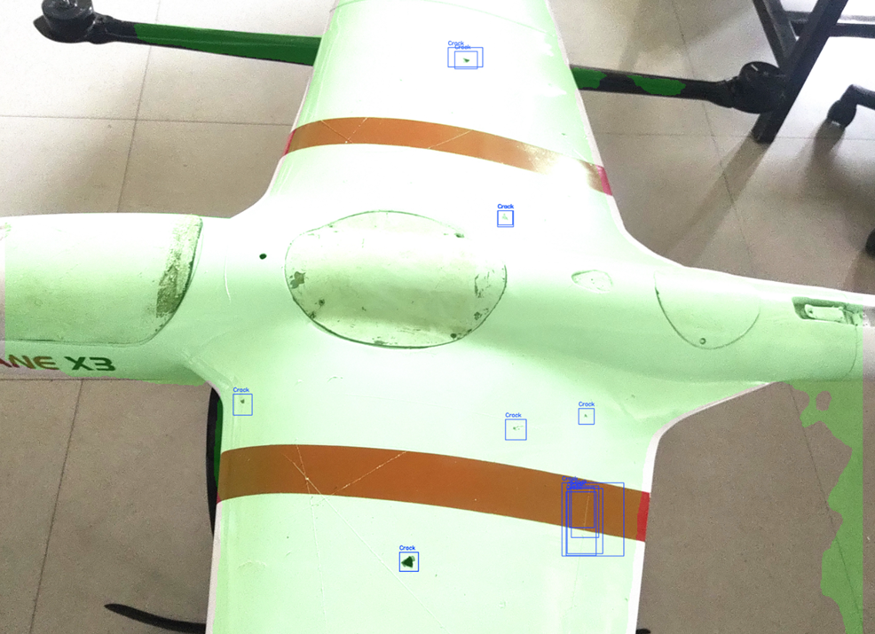
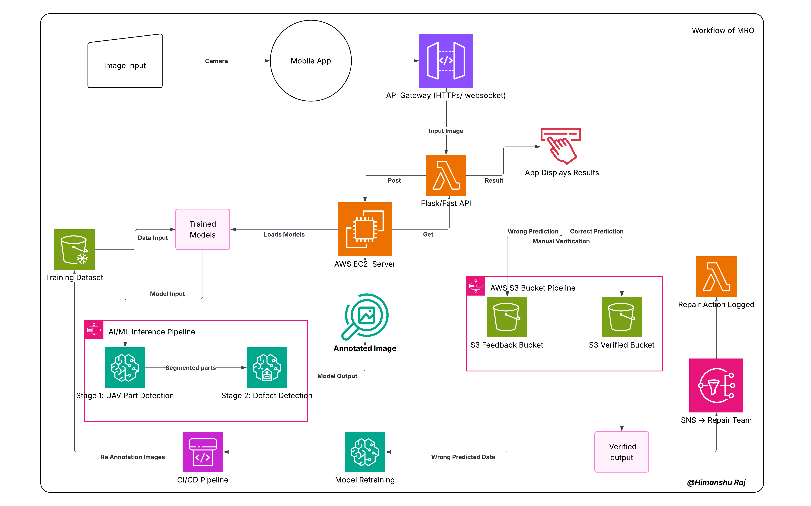
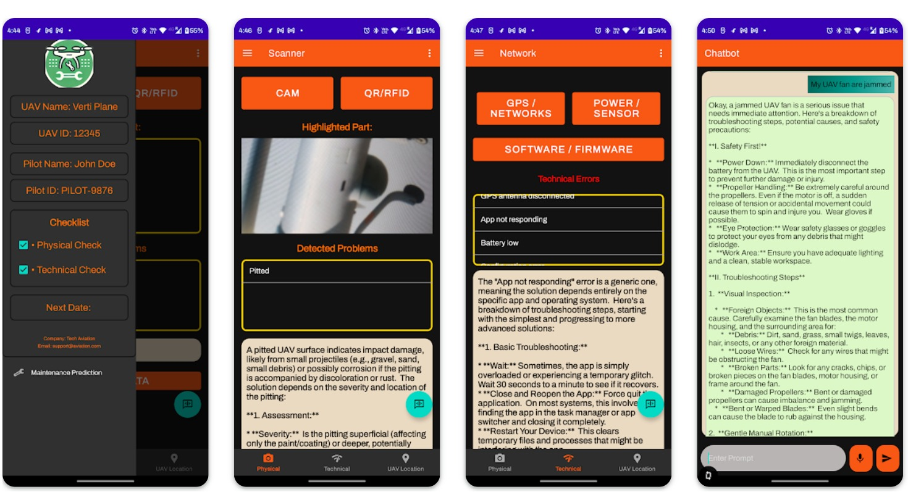
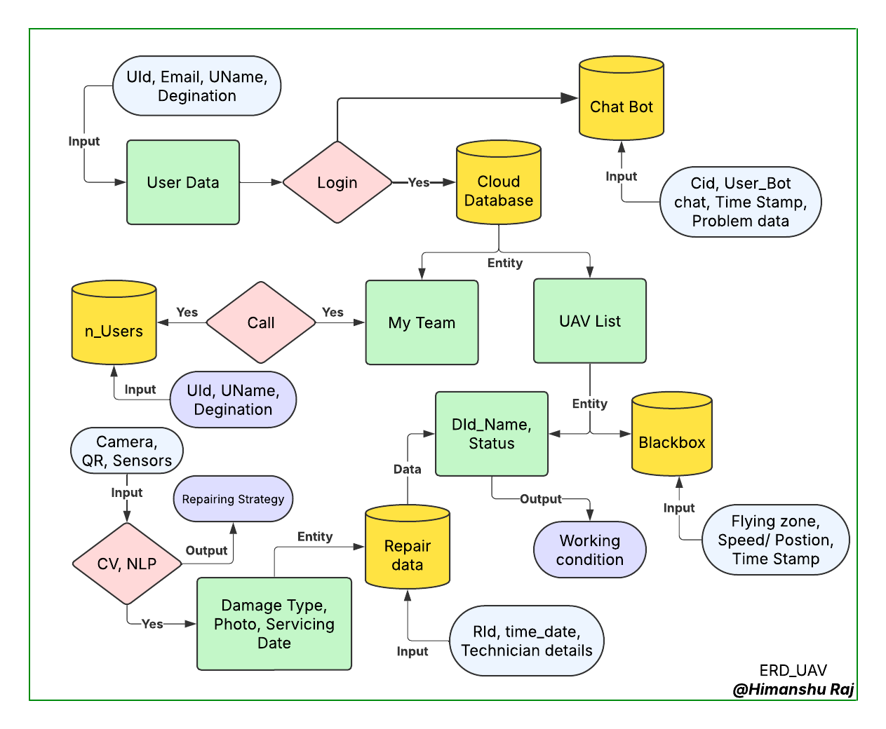
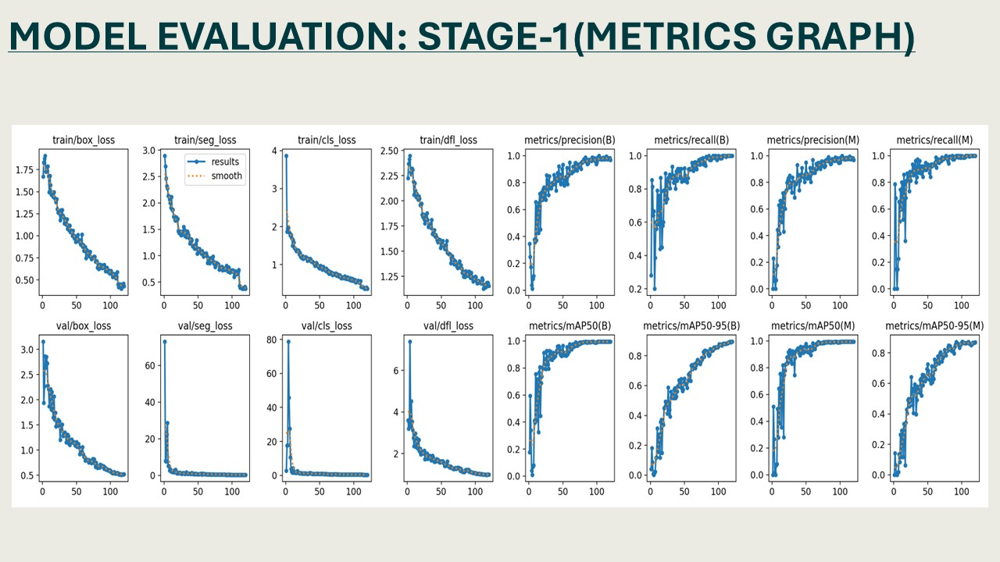
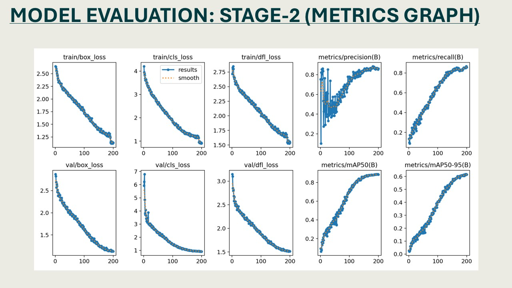

# AI-Powered UAV MRO Inspection Platform

> **An intelligent UAV Maintenance, Repair, and Operations (MRO) platform that combines Computer Vision, Deep Learning, Cloud Infrastructure, and Mobile Technologies to automate UAV inspection, defect detection, maintenance management, and continuous AI model improvement.**

---

## Project Overview

The **AI-Powered UAV MRO Inspection Platform** is an end-to-end intelligent inspection system developed to assist maintenance engineers, quality control (QC) teams, and operations personnel in performing faster, more consistent, and data-driven UAV inspections.

The platform integrates a **React/Android-based mobile application**, **YOLO11-based computer vision models**, and an **AWS cloud backend** to automate the complete maintenance workflow—from image acquisition to defect detection, technician verification, repair management, and continuous model retraining.

Unlike conventional manual inspections, which are highly dependent on technician experience and are often time-consuming, this system leverages Artificial Intelligence to automatically identify UAV components, inspect surface defects, maintain digital inspection records, and continuously improve detection accuracy using operator feedback collected during real-world deployments.

The current system follows a **two-stage AI inspection pipeline**:

- **Stage 1 – UAV Part Detection**
  - Detects UAV body and inspection regions using **YOLO11-Segmentation**.
  - Crops detected UAV components for detailed inspection.
  - Supports UAV identification through QR code recognition.

- **Stage 2 – Surface Defect Detection**
  - Inspects cropped UAV regions using a dedicated **YOLO11 defect detection model**.
  - Detects defects including:
    - Crack
    - Scratch
    - Missing Head (Fasteners/Screws)

After inference, inspection results are returned to the mobile application where technicians manually verify the predictions. Correct predictions are archived for maintenance records, while incorrect predictions are stored as feedback for future model retraining, enabling a continuous Active Learning pipeline.

The platform has been designed using a modular architecture, allowing future integration with predictive maintenance, fleet analytics, digital maintenance logs, automated repair scheduling, and cloud-based MLOps pipelines.

---

## Project Objectives

The primary objectives of this project are:

- Automate UAV visual inspections using Computer Vision.
- Reduce manual inspection time and improve inspection consistency.
- Detect structural defects such as cracks, scratches, and missing fasteners.
- Provide real-time inspection results through a mobile application.
- Create a digital maintenance history for every UAV.
- Enable technician verification and feedback collection.
- Continuously improve model accuracy through Active Learning and model retraining.
- Integrate inspection, maintenance, and repair workflows into a single cloud platform.
- Build a scalable AI-powered MRO ecosystem suitable for enterprise UAV fleet operations.

---


# Technology Stack

The UAV MRO Inspection Platform integrates modern technologies across mobile development, backend services, artificial intelligence, cloud infrastructure, and development tools.

---

## Mobile Application

| Technology | Purpose |
|------------|---------|
| React | User interface |
| JavaScript | Application logic |
| HTML5 | UI Structure |
| CSS3 | UI Styling |

---

## Backend

| Technology | Purpose |
|------------|---------|
| Python | Backend development |
| FastAPI | REST API framework |
| Uvicorn | ASGI server |
| Pydantic | Data validation |

---

## Artificial Intelligence

| Technology | Purpose |
|------------|---------|
| PyTorch | Deep learning framework |
| Ultralytics YOLO11 | Object detection & segmentation |
| OpenCV | Image processing |
| NumPy | Numerical computing |

---

## Cloud Infrastructure

| Technology | Purpose |
|------------|---------|
| AWS EC2 | GPU inference server |
| AWS API Gateway | API management |
| AWS S3 | Image and model storage |
| AWS SNS | Notification service |

---

## Development Tools

| Technology | Purpose |
|------------|---------|
| Git | Version control |
| GitHub | Source code management |
| VS Code | Development environment |
| Postman | API testing |

---


---

## Supported Defect Classes

- Crack
- Scratch
- Missing Head (Fasteners/Screws)

---

## Key Capabilities

✔ Automated UAV Inspection

✔ AI-Based Surface Defect Detection

✔ UAV Part Segmentation

✔ QR-Based UAV Identification

✔ Cloud-Based AI Inference

✔ Mobile Inspection Workflow

✔ Technician Verification System

✔ Feedback Collection Pipeline

✔ Active Learning & Model Retraining

✔ Digital Maintenance Records

✔ Repair Team Integration

✔ AWS Cloud Deployment

✔ Scalable AI Architecture

---

# System Architecture

The platform follows a cloud-based client-server architecture that integrates a mobile application, AI inference services, AWS infrastructure, and a continuous learning pipeline.

Technicians capture UAV images using the mobile application. The captured image is securely transmitted to the cloud through REST APIs, where the AI inference service performs automated inspection using a two-stage Computer Vision pipeline. Inspection results are returned to the mobile application for technician verification. Verified and feedback samples are then utilized to continuously improve the AI models through an active learning workflow.

## High-Level Architecture



---

## Design Philosophy

The system is designed using a modular architecture where each component is independently scalable and maintainable.

- Mobile application and AI services remain decoupled through REST APIs.
- AI models are deployed on cloud GPU infrastructure, minimizing mobile device computation.
- All inference requests are stateless, enabling horizontal scaling.
- Technician feedback is incorporated into the training dataset through an active learning pipeline.
- The architecture supports future integration with ONNX Runtime, TensorRT, Docker, Kubernetes, and enterprise MLOps platforms without major redesign.

---

# Mobile Application

The Mobile Application serves as the primary interface between field technicians and the AI inspection platform. It enables maintenance personnel to perform UAV inspections directly from a smartphone by capturing inspection images, reviewing AI-generated results, and recording maintenance decisions.

The application is designed to simplify the complete inspection workflow while maintaining traceability, reducing manual documentation, and integrating seamlessly with the cloud-based AI inference service.

Instead of running heavy AI models on the mobile device, the application securely sends captured images to the cloud where the AI backend performs inference. The inspection results are then returned to the application for technician verification.

---



## Mobile Application Features

### Authentication

- Secure user login
- Technician authentication
- Role-based application access

---

### UAV Identification

- QR Code Scanner
- Automatic UAV identification
- Inspection linked to the correct aircraft

---

### Image Capture

- High-resolution camera interface
- Capture multiple inspection images
- Image quality validation before upload

---

### AI Inspection

The application communicates with the cloud AI service to perform automated inspections.

Functions include:

- Upload inspection image
- Receive annotated inspection result
- Display detected UAV parts
- Display detected defects
- Show confidence score
- View inspection summary

---

### Technician Verification

After AI inference, technicians review the inspection results.

Available actions:

- ✅ Verify AI Prediction
- 📝 Submit Feedback
- Add inspection remarks
- Approve maintenance report

This verification process creates the active learning pipeline used for future model improvement.

---

### Maintenance Records




The application maintains inspection records including:

- UAV ID
- Inspection date
- Technician information
- AI prediction
- Verification status
- Repair status

---

### Repair Workflow

Verified defects are automatically forwarded to the maintenance workflow.

The repair team receives:

- UAV Identification
- Defect Type
- Defect Location
- Inspection Image
- Repair Priority

After repair completion, the inspection record is updated and closed.

---

## Mobile Application Workflow

```text
Technician Login
        │
        ▼
QR Code Scan
        │
        ▼
Select UAV
        │
        ▼
Capture Inspection Image
        │
        ▼
Upload Image to Cloud
        │
        ▼
Receive AI Inspection Result
        │
        ▼
Review Bounding Boxes
        │
        ▼
      Decision
 ┌───────────────┐
 │               │
 ▼               ▼
Verified      Feedback
 │               │
 ▼               ▼
Repair Queue   Model Improvement
```
The application acts as a lightweight client, while all computationally intensive AI inference is executed on the AWS backend. This architecture minimizes mobile resource consumption, simplifies model updates, and enables deployment of larger AI models without modifying the mobile application.

---

# AI Inspection Pipeline

The AI Inspection Pipeline is the core component of the UAV MRO platform. It performs automated visual inspection of UAVs using a two-stage Computer Vision architecture designed for accurate localization of UAV components and fine-grained surface defect detection.

Instead of directly detecting defects from the entire image, the system first identifies the UAV inspection region and then performs defect analysis on cropped regions. This hierarchical approach significantly reduces background noise, improves localization accuracy, and enables more reliable defect detection.

---

## Pipeline Overview

```text
                Input UAV Image
                       │
                       ▼
            Image Pre-processing
       (Resize • Normalization)
                       │
                       ▼
      Stage 1 : UAV Detection & Segmentation
                       │
                       ▼
         UAV Part Localization & QR Detection
                       │
                       ▼
      Crop UAV Inspection Region (Memory)
                       │
                       ▼
      Stage 2 : Surface Defect Detection
                       │
                       ▼
   Crack • Scratch • Missing Head Detection
                       │
                       ▼
       Bounding Box & Confidence Score
                       │
                       ▼
      Annotated Image + JSON Response
                       │
                       ▼
          Mobile Application Display
```

---

# Stage 1 — UAV Detection & Segmentation

The first stage identifies the UAV and its inspection regions within the captured image.

This stage reduces unnecessary background information before defect inspection and provides accurate localization of UAV structures.

### Responsibilities

- Detect UAV body
- Segment UAV inspection region
- Detect QR Code
- Identify UAV ID
- Generate inspection Region of Interest (ROI)
- Crop detected UAV region in memory

### Model

- YOLO11 Segmentation

### Input

Entire inspection image captured from the mobile application.

### Output

- UAV Bounding Box
- Segmentation Mask
- QR Identification
- Cropped UAV Region

---

# QR-Based UAV Identification

Each UAV contains a unique QR code used for aircraft identification.

The QR module automatically extracts:

- UAV ID
- Registration Number
- Inspection History
- Maintenance Record

This ensures every inspection is linked to the correct aircraft throughout its maintenance lifecycle.

---

# Memory-Based Cropping

Instead of saving cropped UAV regions to disk, the detected inspection regions are cropped directly in memory.

Advantages include:

- Faster inference
- No temporary file creation
- Lower disk I/O
- Reduced latency
- Better scalability

The cropped image is immediately passed to the second-stage defect detection model.

---

# Stage 2 — Surface Defect Detection

The second stage performs fine-grained inspection of the cropped UAV regions.

The objective is to identify structural defects that may affect UAV airworthiness and maintenance requirements.

### Current Detection Classes

- Crack
- Scratch
- Missing Head

Each detected defect is assigned:

- Bounding Box
- Confidence Score
- Defect Class

### Model

- YOLO11 Object Detection

### Input

Cropped UAV inspection region.

### Output

- Defect Bounding Boxes
- Defect Labels
- Confidence Scores
- Inspection Result

---

# Evaluation Metrics

The model was evaluated using the validation dataset after training.



---

 


## 1. Annotated Inspection Image

The inspection image contains:

- UAV Detection
- Defect Bounding Boxes
- Defect Labels
- Confidence Scores

This image is displayed inside the mobile application for technician review.

---

## 2. JSON Response

The backend also returns a structured JSON response.

Example:

```json
{
  "uav_id": "TE-UAV-001",
  "inspection_time": "2026-07-21T14:35:21",
  "results": [
    {
      "part": "Left Wing",
      "defect": "Crack",
      "confidence": 0.91,
      "bbox": [245,120,328,198]
    },
    {
      "part": "Right Wing",
      "defect": "Scratch",
      "confidence": 0.87,
      "bbox": [520,165,610,220]
    }
  ]
}
```

This response is consumed by the mobile application to display inspection results and manage technician workflows.

---

# AI Pipeline Advantages

The two-stage inspection architecture provides several advantages over single-stage defect detection.

- Reduced background interference
- Improved localization accuracy
- Better small-defect detection
- Lower false positives
- Modular model design
- Independent model updates
- Faster future retraining
- Easier deployment and maintenance

This modular pipeline also allows additional inspection models (corrosion, paint damage, loose connectors, structural deformation, etc.) to be integrated in the future without redesigning the complete system.

---

# Cloud Architecture & Deployment

The UAV MRO Inspection Platform follows a cloud-based client-server architecture designed to provide scalable, centralized, and maintainable AI-powered inspections.

Rather than performing AI inference on the mobile device, all Computer Vision models are deployed on an AWS GPU server. This architecture enables the deployment of larger and more accurate deep learning models while minimizing computational requirements on the mobile application.

The mobile application acts as a lightweight client responsible for image acquisition and user interaction, while the backend handles AI inference, data storage, maintenance workflow, and future model updates.

---

### Scalability

- Centralized model deployment
- Supports multiple mobile devices
- Easy model replacement

---

# Current Model Performance

The current model demonstrates encouraging performance under controlled testing conditions.

### Strengths

- Successfully detects major visible defects.
- Real-time inference suitable for mobile-assisted inspections.
- Accurate localization on clear inspection regions.
- Supports cloud-based deployment.
- Fully integrated with the inspection workflow.

---

### Current Limitations

The current implementation is considered a **Beta AI model**.

Observed limitations include:

- Some small defects are missed.
- False positives may occur under complex backgrounds.
- Performance decreases under challenging lighting conditions.
- Generic training images differ from actual UAV surfaces.
- Limited UAV-specific defect dataset.

---

# Development Roadmap

| Phase | Objective | Status |
|--------|-----------|--------|
| Phase 1 | AI-based UAV defect detection | ✅ Completed |
| Phase 2 | Mobile application integration | ✅ Completed |
| Phase 3 | Cloud-based AI inference | ✅ Completed |
| Phase 4 | Technician verification workflow | ✅ Completed |
| Phase 5 | Feedback collection pipeline | ✅ Completed |
| Phase 6 | Active learning pipeline | 🚧 Planned |
| Phase 7 | Predictive maintenance | 🚧 Planned |
| Phase 8 | Fleet management system | 🚧 Planned |
| Phase 9 | Enterprise analytics dashboard | 🚧 Planned |
| Phase 10 | Production MLOps pipeline | 🚧 Planned |

---

# Author - Himanshu Raj

- LinkedIn: https://www.linkedin.com/in/raj04h
- Email: himanshuraj.hr9934@gmail.com
